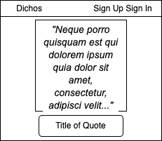
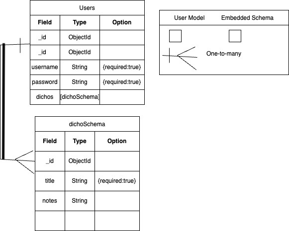

## Application Routes

| Action  | Route | HTTP Verb |
|---------|--------------------------------------|-----------|
| Index   | `/users/:userId/dichos`       | GET       |
| New     | `/users/:userId/dichos/new`   | GET       |
| Create  | `/users/:userId/dichos`       | POST      |
| Show    | `/users/:userId/dichos/:dichoId` | GET   |
| Edit    | `/users/:userId/dichos/:dichoId/edit` | GET  |
| Update  | `/users/:userId/dichos/:dichoId` | PUT   |
| Delete  | `/users/:userId/dichos/:dichoId` | DELETE |

